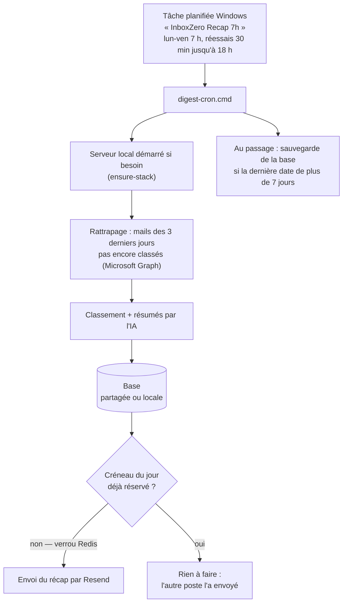

# Gestion Mails — wiki d'exploitation

Fork d'[Inbox Zero](https://github.com/elie222/inbox-zero) adapté à un usage de
cabinet : tri automatique de la boîte Outlook, brouillons de réponse préparés
par l'IA, et **récapitulatif quotidien en français** envoyé chaque matin de
semaine.

Ce wiki est la vue d'ensemble — le pas-à-pas d'installation vit dans
[INSTALLATION.md](INSTALLATION.md).

## Sommaire

- [Ce que fait l'application](#ce-que-fait-lapplication)
- [Une journée type](#une-journée-type)
- [Les deux modes](#les-deux-modes)
- [La boîte à outils](#la-boîte-à-outils)
- [Sauvegardes](#sauvegardes)
- [Dépannage](#dépannage)
- [Sécurité et secrets](#sécurité-et-secrets)
- [Mettre à jour](#mettre-à-jour)
- [Déployer chez une autre organisation](#déployer-chez-une-autre-organisation)
- [Journal de bord](#journal-de-bord)

## Ce que fait l'application

L'application tourne **sur le poste** (serveur local Next.js, port 3000) et se
connecte à Outlook par Microsoft Graph :

- **classement automatique** des mails entrants selon des règles en français,
  avec catégories Outlook à l'appui ;
- **brouillons de réponse** préparés par l'IA quand une règle le demande
  (signature et police réglables, purge quotidienne des brouillons non envoyés) ;
- **récap quotidien** : un seul mail le matin (via Resend), en français, qui
  résume ce qui est arrivé — dates, badge CC, liens vers Outlook, tri par règle ;
- **détection des réponses automatiques** (absence, accusés) pour ne pas les
  résumer inutilement.

L'IA passe au choix par le **CLI Claude** (abonnement, aucun coût au message) ou
par une **clé API** ; `DEFAULT_LLMS` accepte une liste ordonnée avec repli de
l'un vers l'autre.

## Une journée type



Points de conception à connaître :

- **Poste éteint à 7 h** : la tâche réessaie toutes les 30 minutes jusqu'à
  18 h et au premier démarrage du poste ; le rattrapage couvre 3 jours.
- **Deux postes allumés** : la réservation du créneau est atomique
  (`Schedule.nextOccurrenceAt`) — un seul récap part. Si le poste qui a réservé
  disparaît avant d'envoyer, le créneau est rendu au bout de 30 minutes.
- **Jamais de doublon** : un mail déjà classé (`ExecutedRule`) n'est ni
  reclassé ni re-résumé, quel que soit le poste qui l'a traité.

## Les deux modes

| | **partagé** *(défaut)* | **local** |
|---|---|---|
| Base de données | Supabase (hébergée) | PostgreSQL dans Docker, sur le poste |
| Verrous | Redis Upstash (hébergé) | Redis dans Docker |
| Pour quoi | Plusieurs postes, une seule boîte, un seul récap | Poste isolé, essais, dépannage |
| Docker requis | non | oui |

Le mode n'est **pas un réglage** : il est déduit de `DATABASE_URL`. Un seul
fichier `.env` porte les deux configurations — les lignes du mode inactif y
restent en réserve, préfixées `# MODE-LOCAL ` ou `# MODE-PARTAGE `, et
`basculer-mode.cmd` échange les marqueurs puis redémarre le serveur.

> ⚠️ Passer de **partagé à local** fait diverger les deux bases sans retour
> possible. Le script demande confirmation avant.

## La boîte à outils

À la racine du dépôt (aussi dans le kit ZIP) — **double-clic** :

| Outil | Rôle |
|---|---|
| `installer.cmd` | Installe tout (11 étapes), pose deux questions : mode, IA |
| `desinstaller.cmd` | Menu : désactiver / désinstaller / + logiciels partagés |
| `basculer-mode.cmd` | Change de mode (avec garde-fous et redémarrage) |
| `remise-en-service.cmd` | Diagnostique la panne, la **nomme**, propose la réparation |

Dans `.claude\` du dépôt :

| Outil | Rôle |
|---|---|
| `verifier-installation.ps1 -Tous` | Batterie de contrôles **dans les deux modes**, sans rien basculer |
| `sauvegarder-base.cmd` | Sauvegarde manuelle de la base |
| `restaurer-base.ps1` | Restauration — confirmation « REMPLACER » exigée si la base n'est pas vide |
| `configurer-ia.cmd` | (Re)choisir le fournisseur d'IA sans réinstaller |
| `make-kit.ps1` | Fabrique le kit ZIP **et entretient le dossier OneDrive** (`.env`, `.env.local-docker`, `INSTALLATION.md`, suppression des copies à plat) |
| `arreter-serveur.ps1` | Arrête proprement le serveur local |
| `ouvrir-journaux.cmd` | Ouvre le dossier des journaux |

Le raccourci Bureau **« Gestion Mails »** ouvre le portail local
(`http://localhost:3000`).

## Sauvegardes

Le palier gratuit de Supabase **ne fait aucune sauvegarde** : la tâche
planifiée en fabrique une par semaine dans
`%LOCALAPPDATA%\GestionMails\backups\`.

- Fichiers **datés**, les **8 derniers** conservés — jamais d'écrasement.
- Chaque archive est **autonome** (elle embarque les extensions PostgreSQL que
  `pg_dump` n'inclut pas).
- `verifier-installation.ps1` contrôle à chaque passage que la dernière
  sauvegarde existe, est récente (« moins de 8 jours ») et **lisible**.

> **Au retour de congés, ne pas restaurer par réflexe.** Supabase met les
> projets gratuits en pause après 7 jours sans activité : les données sont
> **intactes**, un clic sur « Restore project » dans la console suffit.
> `remise-en-service.cmd` reconnaît ce cas et le dit.

## Dépannage

Premier réflexe : **`remise-en-service.cmd`** (il nomme la panne). Ensuite :

| Symptôme | Piste |
|---|---|
| Base injoignable en mode partagé | Projet Supabase en pause — aucune restauration nécessaire |
| `Tenant or user not found` | Mot de passe changé côté Supabase : le reporter dans `DATABASE_URL` et `DIRECT_URL` |
| Mails plus classés | Session Claude expirée sur **ce** poste : lancer `claude`, se reconnecter |
| Récap absent | Aucun poste allumé entre 7 h et 18 h — le rattrapage couvre 3 jours |
| Récap en double | Un poste tournait sur l'ancienne base : toujours redémarrer le serveur après un changement de `.env` |

Journaux dans `%LOCALAPPDATA%\GestionMails\logs\` : `digest-cron.log` (le fil
du matin), `serveur.log`, `sauvegarde.log`, `catch-up-dernier.json`,
`envoi-dernier.json`. Séquence saine : `mode partage` → `rattrapage passe 1 :
{"done":true,…}` → `envoi recap (curl 0)`.

## Sécurité et secrets

- Le fork est **public** : les secrets ne vont **jamais** sur GitHub. Le `.env`
  voyage par le dossier OneDrive professionnel « Gestion Mails », et
  `.gitignore` exclut `.env*`, les journaux et les sorties d'exécution.
- `EMAIL_ENCRYPT_SECRET` / `EMAIL_ENCRYPT_SALT` chiffrent les jetons OAuth en
  base et doivent être **identiques sur tous les postes**.
- La restauration de base ne touche que les objets appartenant à
  l'application et exige de taper `REMPLACER`.
- La désinstallation n'efface **jamais** les mails, brouillons, catégories
  Outlook, ni le `.env` OneDrive ; les logiciels partagés (Docker, Node) ne
  partent que sur demande explicite.

## Mettre à jour

Les postes partagent une seule base : **ils doivent porter la même version du
code**. Après une évolution, sur **chaque** poste :

```powershell
git pull
pnpm install --config.enable-global-virtual-store=false
pnpm --dir apps/web exec prisma generate
.\.claude\verifier-installation.ps1
```

…puis redémarrer le serveur (raccourci Bureau). Si les scripts du kit ont
changé, refabriquer le ZIP : `.\.claude\make-kit.ps1`.

## Déployer chez une autre organisation

```powershell
.\.claude\make-kit.ps1 -Generique
```

Produit **`Gestion-Mails-Kit-Generique.zip`** : le kit habituel **sans aucun
secret**, plus un **assistant** (`configurer-services`) qui guide l'autre
organisation dans la création de **ses** comptes de service — application
Azure AD dans **son** tenant (3 URI de redirection, 8 permissions Graph,
consentement admin), Resend, et Supabase/Upstash si elle choisit le mode
partagé. L'assistant valide chaque saisie, génère les secrets internes
(chiffrement, clés d'API) et écrit un `.env` complet ; l'installeur crée
ensuite le **schéma de base** (une base vide est détectée et migrée — une base
peuplée n'est jamais touchée).

Mode d'emploi complet côté destinataire :
[INSTALLATION-NOUVELLE-ORGANISATION.md](INSTALLATION-NOUVELLE-ORGANISATION.md)
(embarqué dans le ZIP). Point de licence : exemption jusqu'à **5 utilisateurs**
en entreprise, pas de monétisation.

## Journal de bord

| Date | Événement |
|---|---|
| 26/07/2026 | Phases 1-2 en réel : compte Microsoft branché, récap francisé et enrichi, brouillons IA + détection des réponses automatiques, tâche planifiée 7 h |
| 27/07/2026 | Kit ZIP réparé (piège `$PSScriptRoot` en PowerShell 5.1), purge quotidienne des brouillons, refonte des règles |
| 28/07/2026 | Deux modes (local / partagé) et outillage multi-postes : bascule, sauvegarde/restauration, remise en service, vérificateur |
| 28/07/2026 | Audit du kit : dossier OneDrive assaini (le ZIP devient le seul chemin d'installation, compagnons entretenus par `make-kit.ps1`), correctifs `verifier-installation.ps1` et `install.ps1`, création de ce wiki |
| 28/07/2026 | Kit **générique** pour une autre organisation : assistant `configurer-services`, création du schéma sur base vide, noms de ZIP distincts |
